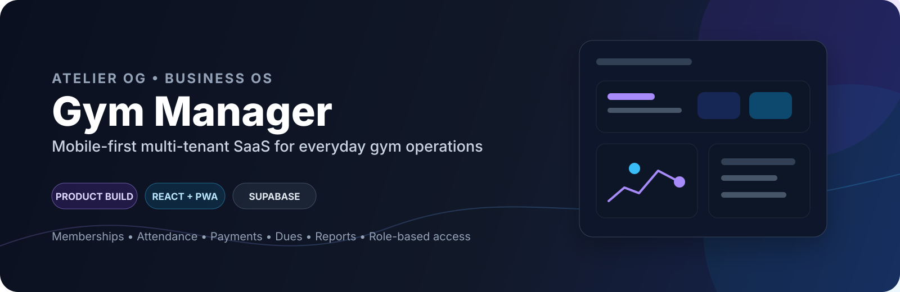
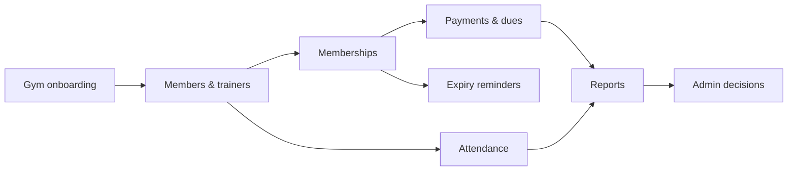

<div align="center">



# Gym Manager

### Mobile-first multi-tenant SaaS for everyday gym operations

**Gym Manager** is a product being developed under **Atelier OG / Business OS** to bring memberships, attendance, payments, dues and renewals into one focused system for independent gyms.

[](docs/CODEROUND_APM_AI_CASE_STUDY.md)
[](docs/ARCHITECTURE.md)
[](https://gym-management-system.atelierog-co.workers.dev/)

</div>

---

## Product snapshot

| | |
|---|---|
| **Product** | Gym Manager |
| **Type** | Mobile-first, multi-tenant SaaS |
| **Builder** | Rahul Kumar · Atelier OG / Business OS |
| **Frontend** | React + Vite · Android PWA model |
| **Backend** | Supabase + PostgreSQL |
| **Security** | PostgreSQL RLS + grants + server-authoritative rules |
| **Hosting** | Cloudflare Workers / Pages |
| **Status** | V1 architecture and product boundary defined; implementation and hardening ongoing |

> This repository is presented as a **product case study and working software project**, not as a claim that the V1 is already production-ready.

---

## Product preview

**Live build:** https://gym-management-system.atelierog-co.workers.dev/

The repository is intentionally documented like a product case study: problem → users → MVP boundary → workflows → architecture → security → AI experiment → validation.

---

## The problem

Small gyms often manage critical daily operations across paper records and spreadsheets. That creates friction around questions such as:

- Who is currently active?
- Who attended today?
- Whose membership is expiring?
- What has been paid and what is still due?
- Who can access which information?

Gym Manager is designed around those operational jobs instead of trying to become an oversized gym-management platform.

---

## What is being built

| Area | V1 capability |
|---|---|
| **Members** | Member records, account status and membership history |
| **Trainers** | Trainer accounts and role-specific access |
| **Memberships** | Plans, start dates, expiry, renewal and lifecycle tracking |
| **Payments** | Fees, dues, partial payments and payment records |
| **Attendance** | Location-based check-in/out and visit history |
| **Reports** | Operational reporting and CSV export |
| **Reminders** | Membership-expiry and operational notifications |
| **Administration** | Gym settings, audit trail and role-based portals |

### Intentionally outside V1

Classes, POS, inventory, CRM, payroll, marketing automation, multi-branch scheduling and other enterprise surfaces are deliberately excluded from the first release.

**Product boundary:** solve the core front-desk workflow before expanding the surface area.

---

## Product thinking

The project follows a simple product loop:

**Problem → User → MVP → Workflow → UX → Architecture → Build → Validate → Iterate**

Key decisions include:

1. Keep the first release small and task-oriented.
2. Use PostgreSQL as the source of truth.
3. Enforce tenant isolation at the database layer with Row Level Security.
4. Keep security-sensitive operations server-authoritative.
5. Make money-changing membership workflows transactional.
6. Validate attendance on the server, including membership, role/status, location/radius, timezone, Sunday closure and duplicate-open-visit rules.
7. Add future functionality when it replaces a real manual task.

---

## Core workflow



---

## Technical architecture

```text
Browser / Android PWA
        │
        ▼
Cloudflare Workers / Pages
        │
        ▼
    React + Vite
        │
   ┌────┴─────────────┐
   ▼                  ▼
Supabase Auth     Supabase Data API
                        │
                        ▼
                 PostgreSQL + RLS
                        │
          ┌─────────────┼─────────────┐
          ▼             ▼             ▼
     Memberships     Payments     Attendance
                        │
                        ▼
                     pg_cron
                        │
              ┌─────────┴─────────┐
              ▼                   ▼
        Auto checkout      Expiry jobs

Privileged operations:
Browser → Supabase Edge Function → Auth Admin / server-authoritative operations
```

### Stack

- **Frontend:** React, Vite
- **Backend/data:** Supabase, PostgreSQL
- **Security:** PostgreSQL Row Level Security, grants, server-side validation
- **Server functions:** Supabase Edge Functions
- **Hosting:** Cloudflare Workers / Pages
- **Database jobs:** PostgreSQL / pg_cron
- **App model:** Mobile-first PWA

---

## Multi-tenant security model

Each gym is treated as an isolated tenant using `gym_id` throughout the data model.

The browser is not trusted to decide authorization. Security-sensitive rules are enforced server-side, with PostgreSQL RLS and controlled grants protecting tenant data.

Examples of server-authoritative rules include:

- tenant isolation
- role and account status
- membership validity
- attendance location/radius
- duplicate open visits
- Sunday closure
- payment and membership transaction boundaries

A successful frontend build is therefore **not** treated as proof that the product is production-ready.

---

## Roles

### Platform Super Admin
Platform-level onboarding and gym-management operations.

### Gym Admin
Members, trainers, memberships, payments, dues, attendance, reports, settings and audit operations.

### Trainer
Operational attendance access without member financial administration.

### Member
Own membership, payment history, attendance and check-in/out access.

The detailed permission model is documented in [ARCHITECTURE.md](docs/ARCHITECTURE.md).

---

## AI product experiment

A potential next experiment is an **operations copilot** that can summarize expiring memberships and outstanding dues, cite the underlying records, and propose safe outreach actions.

The feature would be validated against:

- factual accuracy
- permission boundaries
- action safety
- time saved for gym staff

The goal is to test whether AI can remove a real operational task without weakening trust or control.

---

## Why this project matters to my product work

I am using Gym Manager as a hands-on product-building exercise across the full lifecycle:

**Discovery → requirements → MVP scope → user workflows → UX → technical architecture → implementation → security → validation → iteration**

It combines product thinking with direct implementation, which is the kind of cross-functional work I want to continue developing in product and AI-focused roles.

---

## Current status

**V1 architecture and product boundary are defined, with implementation and hardening work ongoing.**

The repository includes the product foundation, database source of truth, security model, migrations and recruiter-facing case study.

---

## Documentation

- **[Product Case Study](docs/CODEROUND_APM_AI_CASE_STUDY.md)** — product problem, decisions, MVP and AI experiment
- **[Architecture & Security](docs/ARCHITECTURE.md)** — tenant isolation, roles, transactions and release gates
- **[Database Schema](supabase/schema.sql)** — database source of truth
- **[Migrations](supabase/migrations/)** — production schema change path
- **[GitHub Profile Pack](docs/RAHUL_KUMAR_GITHUB_PROFILE_PACK.md)** — recruiter-facing profile material

---

## Builder

**Rahul Kumar**  
Product builder • SaaS • AI & Automation  
BCA, Arka Jain University  
Retail Gemologist, Tanishq

This project is part of my broader work under **Atelier OG / Business OS**, where I build practical digital products and business systems.

---

<div align="center">

**Building practical software from problem discovery to implementation.**

</div>
